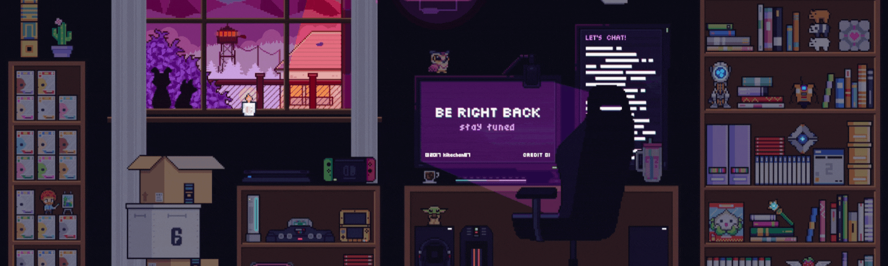

<h2 align="center">Hi,  I am Moinak Majumdar </h2>
<h3 align="center">A passionate full stack web developer from India</h3>

## 🚀About Me

- 👨‍💻 I am basically a junior front end developer and also interested in full stack.
- 😁 I am always open to learn new things and currently learning about Next js.
- 🥅 2022 Goals: Keep learning and keep contributing
- ⚡ Fun fact: I love dark theme 🐲

  

## Connect with me:     

    
    
    

## Tech Stack:

    
    
    
    
    
    
    
    
    
    
    
    
    
    
    
    
    
    

### GitHub Stats:

